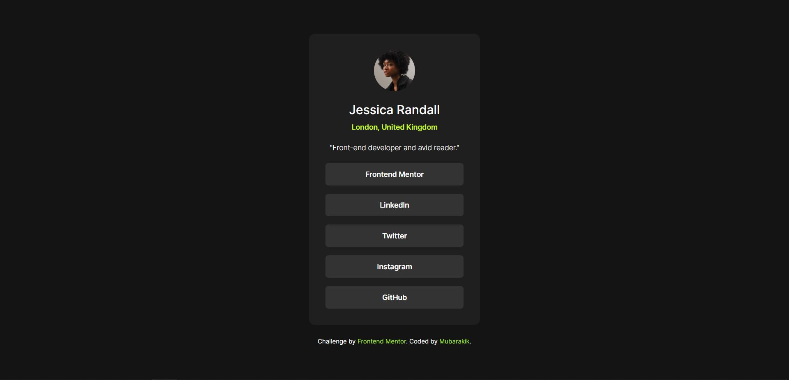

# Frontend Mentor - Social links profile solution

This is a solution to the [Social links profile challenge on Frontend Mentor](https://www.frontendmentor.io/challenges/social-links-profile-UG32l9m6dQ). Frontend Mentor challenges help you improve your coding skills by building realistic projects.

## Table of contents

- [Overview](#overview)
  - [The challenge](#the-challenge)
  - [Screenshot](#screenshot)
  - [Links](#links)
- [My process](#my-process)
  - [Built with](#built-with)
  - [What I learned](#what-i-learned)
  - [Useful resources](#useful-resources)
- [Author](#author)

**Note: Delete this note and update the table of contents based on what sections you keep.**

## Overview

### The challenge

Users should be able to:

- See hover and focus states for all interactive elements on the page

### Screenshot



### Links

- Live Site URL: [https://social-links-profile-main-three-neon.vercel.app/](https://social-links-profile-main-three-neon.vercel.app/)

## My process

### Built with

- HTML5
- [Tailwind CSS](https://tailwindcss.com/) - For styles

### What I learned

While working on this project, I learned how to use arbitrary color values in Tailwind, when I couldn’t find an exact match in the default Tailwind color palette. Instead of settling for a close alternative, I learned to apply exact design values using HSL like this:

```html
<div class="bg-[hsl(0,_0%,_20%)] text-[hsl(75,_94%,_57%)]">content</div>
```

This showed me how highly customisable tailwind is.

### Useful resources

- [Tailwind Play CDN](https://tailwindcss.com/docs/installation/play-cdn) – This was my starting point for using Tailwind without setting up a full build process. It made it really easy to experiment and see results instantly, which was super helpful.

- [Tailwind Cheat Sheet – Nerdcave](https://nerdcave.com/tailwind-cheat-sheet) - This cheat sheet was incredibly useful for quickly looking up class names and syntax while working on the project. It's a great reference to have open alongside your code.

- [Tailwind Color Reference](https://tailwindcss.com/docs/colors) – This helped me understand and apply Tailwind’s color system correctly. I referred to it often while matching the design specs and choosing semantic, accessible colors.

- [Tailwind Shadow Generator](https://folge.me/tools/tailwind-shadow-generator) – This helped me generate custom shadow values quickly and visually, making it easier to craft shadows that fit the exact offsets, blur, and colors I needed for this design.

## Author

- Frontend Mentor - [@mubarakik](https://www.frontendmentor.io/profile/mubarakik)
- GitHub - [@mubarakik](https://github.com/mubarakik)
- LinkedIn - [@mubaraka-kikonyogo](https://www.linkedin.com/in/mubaraka-kikonyogo-950010271)
- X - [@mubarakik\_](https://twitter.com/mubarakik_)
